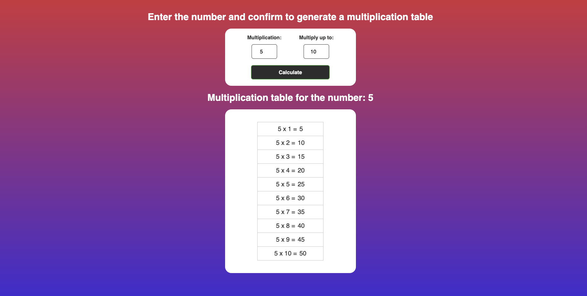

# Math Table
 Empowering Learning Through Multiplication Tables

 "MathTable is an innovative educational project aimed at empowering students and educators by providing an interactive platform for learning multiplication tables. Our user-friendly calculator helps students practice and master multiplication skills while making learning fun and engaging. By supporting MathTable, you're contributing to a brighter future of math education. Join us in our mission to make math tables accessible to all!"

<h1>↓↓↓</h1>
<h3><a href="https://jcizidrosilva.github.io/Math-Table/" target="">Explore the Project</a></h3>

